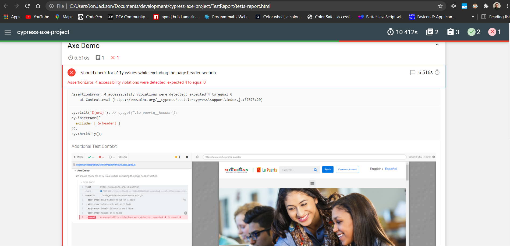

# A11y Testing With Cypress

## To use this project

In a git bash terminal, clone this repo to your local computer by running the following command in your chosen local directory:
```
git clone https://github.com/jon424/axe-with-cypress.git
```

Change directories so that your terminal is located at 'axe-with-cypress':
```
cd axe-with-cypress
```
run:
```
npm install cypress --save-dev
```
to run a sample test from the command line:
```
npm run clean:reports & node_modules/.bin/cypress run --env url=https://www.mihc.org/la-puerta/,selectors=.la-puerta-logo
```
then, to generate the html report:
```
npm run generate:html:report
```

Then, open the html file (located in TestReport/tests-report.html)

You can see some accessibility tests passing, and others failing. Clicking on the test result will show Additional Test Context that contains the types of accessiblity errors that are present on the page you are testing.



